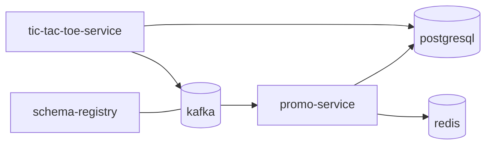

# Promo Infrastructure


Docker Compose stack for running the promo platform locally: the messaging, storage and caching the services need,
plus the services themselves.

## What it starts

| Service | Image | Port | Notes |
| --- | --- | --- | --- |
| `kafka` | `confluentinc/cp-kafka:7.5.0` | 9092 | KRaft mode (no ZooKeeper), single node |
| `schema-registry` | `confluentinc/cp-schema-registry` | 8081 | Confluent Schema Registry |
| `postgresql` | `postgres:15-alpine` | 5432 | Persistent volume `pg_data`, health check with `pg_isready` |
| `redis` | `redis:7.4.7-alpine` | 6379 | AOF persistence, 64 MB limit with `allkeys-lru` eviction, password protected |
| `tic-tac-toe-service` | built from source | 8082 | Waits for healthy PostgreSQL and Kafka |
| `promo-service` | built from source | 8083 | Waits for healthy PostgreSQL and Kafka, and for Redis |



## Running it

The service images are built from sibling folders, so clone the repositories next to each other:

```
workspace/
├── promo-infrastructure/     (this repo)
├── PromoService/
├── TicTacToeService/         (clone of TicTacToe-Project)
└── PromoBridgeSDK/           (clone of promobridge-sdk)
```

```bash
cd promo-infrastructure
docker compose up -d                 # start everything
docker compose ps                    # check health
docker compose logs -f promo-service # follow a service
docker compose down                  # stop (volumes are kept)
```

Credentials in `docker-compose.yaml` are local development values only; in a real environment they come from a
secrets store.

## Design choices

- **Kafka in KRaft mode:** one process instead of Kafka + ZooKeeper, which is the direction Kafka itself has taken.
- **Redis with LRU eviction and AOF:** the leaderboard cache stays within a fixed memory budget, and survives restarts.
- **Health-checked start-up order:** services start only when their dependencies report healthy, instead of retrying blindly.

## Next steps

- Add Elasticsearch, Kibana and Filebeat for centralised logs
- Move secrets to an `.env` file excluded from Git
